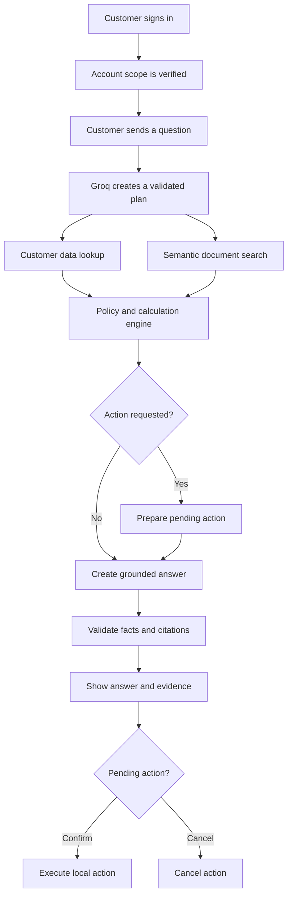
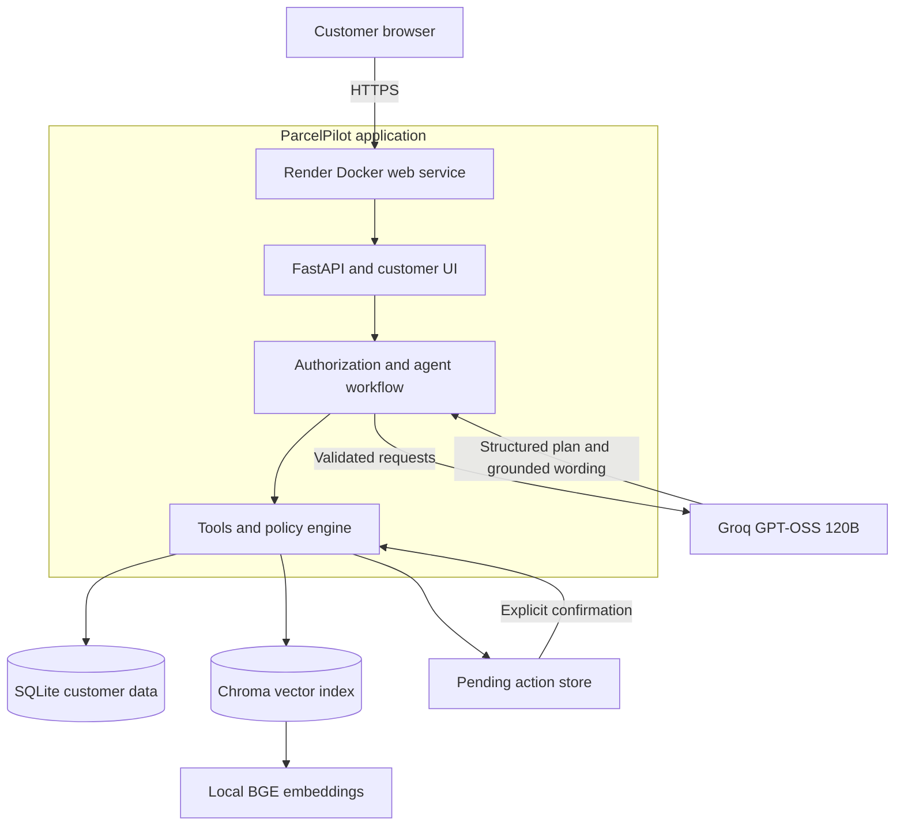

# Architecture Note

## Project design

ParcelPilot Customer Support is one customer-facing chatbot. A signed-in customer can ask about orders, tickets, cancellations, service credits, SLAs and known product issues.

The design is hybrid:

- Groq understands natural language and prepares a structured tool plan.
- Python enforces authorization, source priority, calculations and action rules.
- SQLite stores customer data and action records.
- BGE embeddings and Chroma provide semantic document search.

## End-to-end workflow



## Hosted architecture



### Deployment flow

1. The project is committed and pushed to a GitHub repository owned by the candidate.
2. Render reads `render.yaml` and the root `Dockerfile` from that repository.
3. Render builds the Docker image.
4. The Docker build installs Python packages, imports the supplied Excel workbook and builds the BGE and Chroma document index.
5. Render starts FastAPI on the port supplied through the `PORT` environment variable.
6. The `GROQ_API_KEY` is added privately in the Render dashboard and is available only to the backend.
7. Render checks `/api/health` before marking the service ready.
8. Render provides an HTTPS URL ending in `.onrender.com`.
9. Later pushes to the connected GitHub branch trigger a new build and deployment.

The frontend and backend are served by the same FastAPI application. This keeps login cookies, API calls and deployment simple for the assessment.

## Request processing

1. **Sign-in**  
   The server verifies the username and password. A signed session stores the customer account ID.

2. **Authorization**  
   Every request is locked to the signed-in account. The browser cannot choose a different account ID.

3. **Request understanding**  
   Groq converts the question into a Pydantic-validated plan. Exact order and ticket IDs are also checked against the original message.

4. **Tool execution**  
   The agent selects structured-data lookup, document search, calculation or action preparation. A multi-step question can use several tools.

5. **Business decision**  
   Python applies agreement overrides, cancellation rules, service-credit rules, severity definitions and SLA calculations.

6. **Answer creation**  
   Groq receives verified facts and approved evidence. It writes a clear answer with citation IDs such as `[D1]` and `[D2]`.

7. **Validation**  
   The backend checks the answer, citations and action state before sending the response.

8. **Action confirmation**  
   Escalations and follow-ups are first stored as pending. A separate authenticated request confirms or cancels the action.

## Agent design

The agent uses a controlled sequence of stages:

```text
authorize -> plan -> lookup -> calculate -> retrieve -> prepare action -> compose -> validate
```

The LLM can suggest a plan, but it cannot directly access the database or execute an action. Each stage returns structured data. The interface displays a short tool event for each stage.

## Tool design

| Tool | Purpose | Main safety control |
|---|---|---|
| `document_search` | Searches agreements, policies, SOPs and product documents | Removes unauthorized and deprecated content before retrieval |
| `customer_data_lookup_and_calculation` | Reads customer, order and ticket data and performs calculations | Every database query includes the signed-in account ID |
| `customer_action` | Prepares escalations and follow-ups | Requires a separate confirmation before execution |

The tools return only the data needed for the current request. Raw database access and unrestricted files are never passed to the LLM.

## Document handling and semantic RAG

The six supplied PDFs are read with `pypdf`. Their text is divided into 25 chunks. Each chunk keeps its document name, page, section, source type and customer scope.

FastEmbed uses `BAAI/bge-small-en-v1.5` to convert each chunk into a semantic vector. Chroma stores the vectors and returns passages with similar meaning. This allows a question such as “large spreadsheet import” to find content about “large CSV bulk uploads.”

Before search, the retriever removes agreements belonging to other customers and excludes deprecated documents from current answers.

## Structured-data handling

`openpyxl` imports the supplied Excel workbook into SQLite. The database contains:

- 4 customer accounts;
- 6 orders;
- 7 support tickets; and
- the fixed dataset snapshot time.

All time calculations use `2026-08-16 11:00 Asia/Kolkata`. This keeps results consistent during demonstrations and tests.

Every order and ticket query includes the signed-in account ID. A customer cannot discover whether an inaccessible record belongs to another account.

## Source reliability and conflict handling

The source order is:

1. Active agreement for the signed-in customer
2. Current policy or SOP
3. Current product documentation
4. Historical ticket resolutions as context only
5. Deprecated documents excluded from current answers

An agreement overrides a general rule only when it contains a relevant term. Historical ticket answers never become current policy. When sources disagree, the response explains which source has higher authority.

Missing or conflicting evidence produces a verification message instead of a guessed answer.

## Major technical trade-offs

### Controlled workflow

A clear Python workflow keeps execution easy to test and review. It provides multi-tool agent behaviour without unnecessary orchestration complexity.

### Local semantic embeddings

The BGE model provides learned semantic search without a separate embedding API. The model is downloaded during the first setup and then runs locally.

### SQLite storage

SQLite keeps the assessment portable and easy to run. The same data layer can later move to a managed database for larger production workloads.

### Local action records

The complete prepare, confirm and cancel workflow is implemented. Confirmed assessment actions are stored locally in SQLite.

## Main technologies

| Component | Technology |
|---|---|
| API and application server | FastAPI and Uvicorn |
| Data validation | Pydantic |
| Language model | Groq `openai/gpt-oss-120b` |
| Embeddings | FastEmbed `BAAI/bge-small-en-v1.5` |
| Vector database | Chroma |
| Structured database | SQLite |
| Excel and PDF processing | openpyxl and pypdf |
| Password hashing | bcrypt |
| Interface | HTML, CSS and JavaScript |
| Testing | pytest and Ruff |
| Packaging | Docker |
